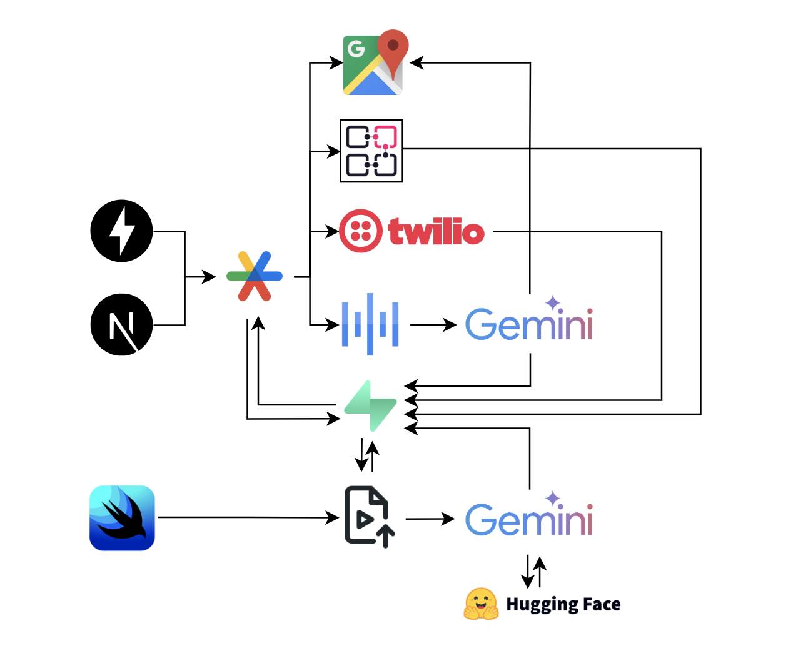

# Yumi

  <h3>🏆 3rd Place at HackHarvard 2025 🏆</h3>
  
<em>An Agentic Social Food Network</em>

---

An agentic social network for dining where AI agents learn your taste, blend friend preferences, and orchestrate perfect group meals through natural language understanding and intelligent coordination.

Deployed Website: [findwithyumi.netlify.app](https://findwithyumi.netlify.app/) \
Figma Deck: [Slides](https://www.figma.com/slides/Ow9o0zbgZ2FhKydvVrlrPD/Untitled?node-id=29-18&t=e91GSp6WS6YBLS8f-1) 

### Tech Stack

  

**Tech Stack:** Swift, SwiftUI, Python, FastAPI, TypeScript, React, Next.js, Supabase, Google Gemini, Google Places API, ElevenLabs, HuggingFace, Render, Netlify

