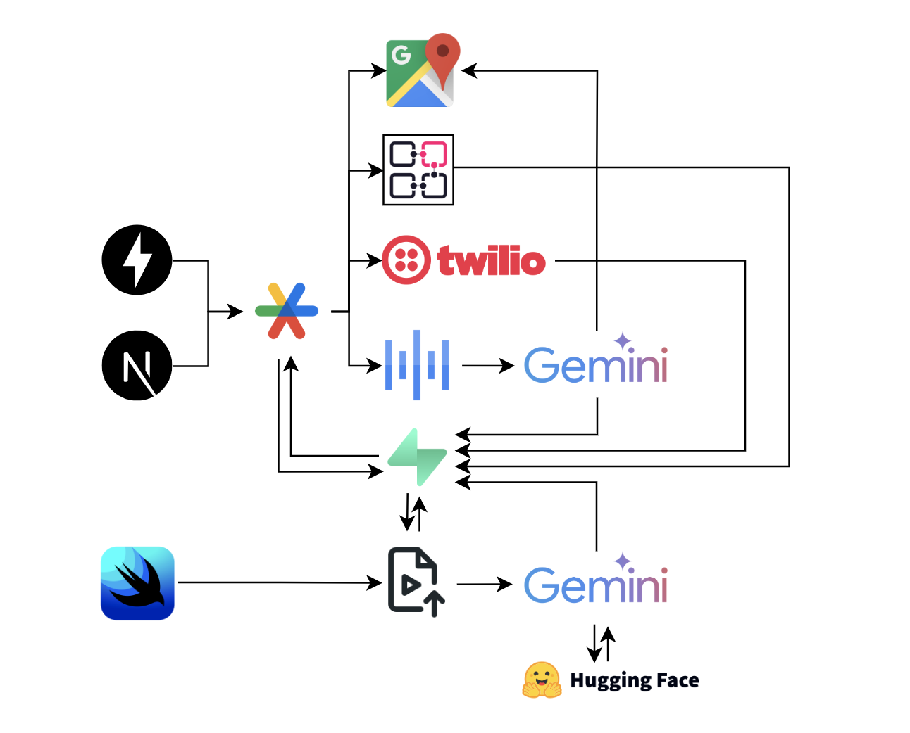

# Yumi

  <h3>🏆 3rd Place at HackHarvard 2025 🏆</h3>
  
<em>An Agentic Social Food Network</em>

---

  

### Overview
An agentic social network for dining where AI agents learn your taste, blend friend preferences, and orchestrate perfect group meals through natural language understanding and intelligent coordination.

Figma Deck: [Slides](https://www.figma.com/slides/Ow9o0zbgZ2FhKydvVrlrPD/Untitled?node-id=29-18&t=e91GSp6WS6YBLS8f-1)
Read more here: [Devpost Submission](https://devpost.com/software/yumi?_gl=1*1r73ntc*_gcl_au*MTU3NzE5NTczNS4xNzYxNDY0ODQ2*_ga*MTgyODMxMjEzNS4xNzYxNDY0ODQ3*_ga_0YHJK3Y10M*czE3NjIyMjY1NTAkbzE2JGcwJHQxNzYyMjI2NTUwJGo2MCRsMCRoMA..)

### Tech Stack

  

**Tech Stack:** Swift, SwiftUI, Python, FastAPI, TypeScript, React, Next.js, Supabase, Google Gemini, Google Places API, ElevenLabs, HuggingFace, Render, Netlify
